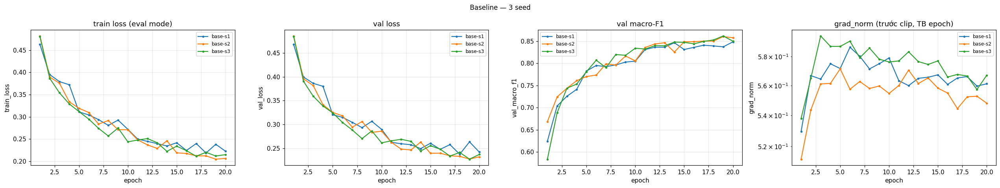
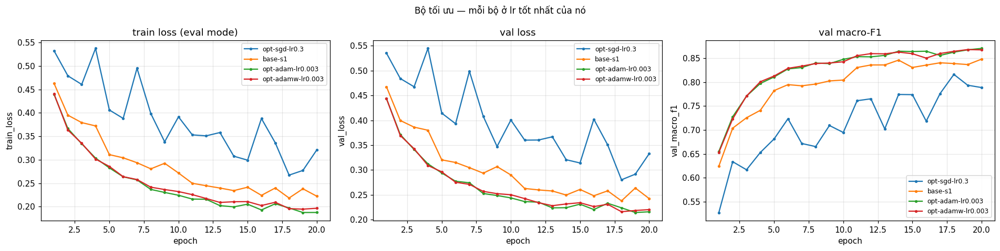
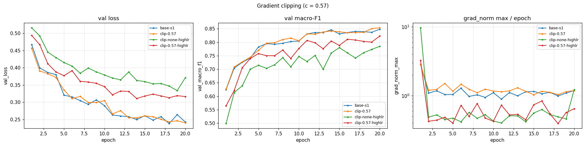
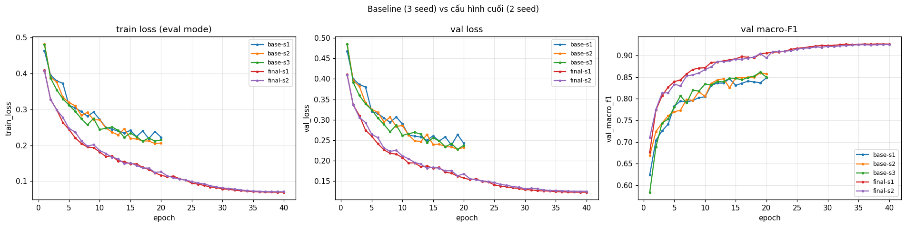

# Báo cáo Lab Day 1 — Nguyễn Văn Quốc Việt — 2A202602973

## 1. Thiết lập

- **Môi trường:** Google Colab, GPU Tesla T4, PyTorch 2.11.0 (CUDA 13.0). Mọi số liệu trong báo cáo lấy từ `experiments.xlsx` / `results/<exp_id>.json` (đo trên **val**), riêng mục 4 lấy từ `eval_result.json`.
- **Dữ liệu:** Forest CoverType; `train` 464 809 / `eval` 116 203 theo `split_metadata.csv`. Validation: 20% của train (phân tầng, seed 42) → 371 847 train / 92 962 val. Chuẩn hoá 10 cột số bằng mean/std **chỉ tính trên phần train**; 44 cột nhị phân giữ nguyên. Seed tách val cố định cho mọi thí nghiệm.
- **Model:** `M-base` (54→256→128→7, 47 879 tham số, ReLU, có bias, logit thô). **Baseline:** cross-entropy, SGD + momentum 0,9, **lr = 0,1** (chọn bằng val, mục 3.3), batch 512, 20 epoch, khởi tạo He (`kaiming_normal_`, bias = 0), không dropout/clip, FP32.
- **Cách đo:** train loss đo ở `eval()` trên một tập con cố định 50 000 mẫu của train; `grad_norm` = chuẩn L2 toàn cục **trước clip**, trung bình theo epoch; metric báo cáo tại epoch có **val loss thấp nhất**.
- **Mốc tham chiếu:** accuracy "đoán lớp đa số" trên val = **0,4876** (macro-F1 ≈ 0,094).
- **Các chủ đề đã thử:** ☑ loss ☑ optimizer ☑ hyper-parameter ☑ dropout ☑ clipping ☑ mixed precision ☑ init — tổng **31 lần chạy** (31 dòng trong bảng, 31 ảnh `figures/<exp_id>.png`).

## 2. Kiểm tra ban đầu và độ nhiễu

| Kiểm tra | Kết quả |
|---|---|
| Số tham số / shape logits | 47 879 / (B, 7) — có `assert`; M-wide 161 287, M-deep 55 687 cũng khớp |
| Khởi tạo He thật sự được áp dụng | std(W) = 0,1936 / 0,0885 / 0,1246 ≈ √(2/n_in) = 0,1925 / 0,0884 / 0,1250 |
| Loss bước 0 (so với ln 7 = 1,946) | 2,2073 (seed 0, notebook Part 1); 2,269 với seed 1 (`base-s1`) |
| Quá khớp 20 mẫu: loss cuối | 0,000004 sau 500 bước (từ 1,9668), accuracy 100% |
| Mọi tham số có gradient khác 0 | ☑ có (W1, b1, W2, b2, W3, b3) |
| Baseline, số seed đã chạy | 3 (`base-s1`, `base-s2`, `base-s3`) |
| Baseline: val acc (TB ± σ) | 0,9082 ± 0,0024 |
| Baseline: val macro-F1 (TB ± σ) | 0,8535 ± 0,0126 (từng seed: 0,8390 / 0,8601 / 0,8614) |

**Ngưỡng nhiễu dùng trong báo cáo:** 2σ = **0,0251** (val macro-F1). Mọi Δ dưới đây là so với **trung bình 3 seed baseline (0,8535)**, không so với riêng `base-s1` (seed 1 thấp bất thường, so với nó sẽ phóng đại cải thiện). Các thí nghiệm khác chỉ chạy 1 seed, nên |Δ| vượt 2σ là bằng chứng mạnh, còn dưới 2σ là **chưa kết luận được**.

**Loss bước 0 cao hơn ln 7 (≈ +0,26–0,32)** là điều đã đo được, không phải lỗi: ln 7 chỉ đạt khi 7 logit bằng nhau, nhưng He cho logit ở bước 0 có std ≈ 0,58 (bảng ở 3.7) ⇒ softmax lệch ngẫu nhiên. Đối chứng: `init-zeros` và `init-normal` (logit ≈ 0) cho đúng 1,946.

**Đường cong baseline** (`figures/base-s1.png`, `figures/compare_baseline_seeds.png`): val loss giảm nhanh 0,4675 → 0,2900 (epoch 1 → 10) rồi chậm dần tới 0,2426 ở epoch 20, 5 epoch cuối vẫn giảm 0,018 ⇒ chưa hội tụ hẳn. Gap val − train cuối chỉ 0,020 ⇒ **chưa quá khớp** (triệu chứng "train và val cùng cao, khoảng cách nhỏ" trong bảng chẩn đoán). grad_norm ổn định 0,53–0,59, max theo bước 2,84.

## 3. Kết quả theo chủ đề

### 3.1 Hàm mất mát — CE vs MSE
- **Dự đoán:** MSE (trên logit và one-hot) cho gradient nhỏ, không phạt mạnh dự đoán sai nặng như CE ⇒ hội tụ chậm hơn, macro-F1 thấp hơn.
- **Kết quả:** `loss-mse` đạt val macro-F1 **0,7277** (acc 0,8705) so với 0,8535 ± 0,0126 ⇒ **Δ = −0,126, gấp 5 lần 2σ**. F1 ở epoch 5: 0,616 (MSE) so với 0,782 (CE, `base-s1`). Ảnh: `figures/compare_loss.png`. MSE được tính bằng `F.mse_loss(logits, one_hot)`, trung bình trên B×7 phần tử, không có hệ số 1/2. Không so độ lớn loss vì hai loss khác thang đo.
- **Giải thích:** gradient của CE theo logit là (softmax − one-hot): lớn khi xác suất lớp đúng nhỏ và không bão hoà. Gradient của MSE theo logit là 2(z − y)/7, nhỏ hơn nhiều (grad_norm của `loss-mse` chỉ 0,06–0,10, của baseline 0,53–0,56). MSE tối ưu khoảng cách tới vector one-hot chứ không tối ưu trực tiếp xác suất lớp đúng, nên lớp hiếm ít được ưu tiên ⇒ macro-F1 giảm mạnh hơn accuracy. Dự đoán **khớp**.

### 3.2 Bộ tối ưu hoá
- **Dự đoán:** SGD thuần cần lr lớn hơn SGD+momentum. Adam/AdamW hội tụ nhanh hơn ở đầu và hơn SGD+momentum một chút ở lr tốt nhất. AdamW (wd 0,01) ≈ Adam vì mô hình chưa quá khớp.
- **Kết quả.** Mỗi bộ thử ≥ 2 lr, so ở lr tốt nhất của nó:

| Bộ tối ưu | lr đã thử → val macro-F1 | lr tốt nhất (`exp_id`) | val macro-F1 | best epoch | Δ vs baseline |
|---|---|---|---|---|---|
| SGD | 0,1 → 0,7551; 0,3 → 0,8163 | `opt-sgd-lr0.3` | 0,8163 | 18 | −0,037 (vượt 2σ) |
| SGD + momentum 0,9 | 0,01 → 0,7613; 0,03 → 0,8170; 0,1 → 0,8390 | `base-s1..s3` | 0,8535 ± 0,0126 | 18–19 | — |
| Adam (β = 0,9/0,999, ε = 1e-8) | 3e-4 → 0,7877; 1e-3 → 0,8456; 3e-3 → 0,8677 | `opt-adam-lr0.003` | 0,8677 | 19 | +0,014 (trong nhiễu) |
| AdamW (wd = 0,01) | 1e-3 → 0,8482; 3e-3 → 0,8646 | `opt-adamw-lr0.003` | 0,8646 | 18 | +0,011 (trong nhiễu) |

- **Độ nhạy với lr** (`figures/compare_optimizer.png`): cả 4 bộ đều nhạy với lr. Hạ lr 3 lần làm F1 giảm 0,016–0,061, mạnh nhất ở Adam 1e-3 → 3e-4 (−0,058) và SGD+momentum 0,03 → 0,01 (−0,056). lr nhỏ chủ yếu gây **hội tụ chậm** (best epoch = 20, đường cong còn dốc), không gây dao động. Ở lr = 1 (`clip-none-highlr`, mục 3.5) SGD+momentum dao động rõ.
- **Giải thích:** momentum μ = 0,9 làm bước hiệu dụng ≈ lr/(1−μ) = 10·lr và làm mượt hướng đi, nên SGD thuần ở lr 0,3 vẫn kém SGD+momentum ở lr 0,1. Adam chia bước theo √v̂ của từng tham số, nên tham số có gradient nhỏ vẫn được cập nhật đủ lớn ⇒ đi nhanh hơn ở đầu (F1 epoch 5: 0,811 so với 0,782). Tuy vậy, chênh lệch cuối cùng của Adam so với SGD+momentum (+0,014) **nhỏ hơn 2σ ⇒ chưa kết luận Adam tốt hơn**. Adam và AdamW chênh 0,003 ⇒ weight decay 0,01 gần như không tác động.

### 3.3 Hyper-parameter
Ảnh: `figures/compare_lr.png`, `figures/compare_batch.png`, `figures/compare_arch.png`.

| `exp_id` | Thay đổi | Số bước (20 epoch) | s/epoch | val macro-F1 | Δ vs baseline |
|---|---|---|---|---|---|
| `hp-sgdm-lr0.01` / `hp-sgdm-lr0.03` | lr 0,01 / 0,03 | 14 540 | 1,3 / 1,2 | 0,7613 / 0,8170 | −0,092 / −0,037 |
| `hp-batch128` | batch 128 | 58 120 | 4,9 | 0,8561 | +0,003 (trong nhiễu) |
| `hp-batch2048` | batch 2048, giữ lr | 3 640 | 0,3 | 0,7970 | −0,057 (vượt 2σ) |
| `hp-batch2048-lrx4` | batch 2048, lr × 4 (đổi 2 yếu tố) | 3 640 | 0,3 | 0,8458 | −0,008 (trong nhiễu) |
| `hp-wide` | M-wide 512-256 | 14 540 | 1,3 | 0,8735 | +0,020 (dưới 2σ) |
| `hp-deep` | M-deep 256-128-64 | 14 540 | 1,4 | 0,8648 | +0,011 (trong nhiễu) |

- **lr:** F1 tăng đều theo lr đến 0,1, và 0,1 nằm ở **biên lưới** ⇒ lr tối ưu có thể lớn hơn (hạn chế).
- **Batch:** cùng 20 epoch nhưng số bước khác nhau. Batch 2048 có ít hơn 4 lần số bước ⇒ kém rõ ở cùng lr. Áp dụng quy tắc "lô ×4 thì lr ×4" bù gần hết (Δ chỉ −0,008) và nhanh hơn 3,7 lần (0,33 so với 1,22 s/epoch): gradient của lô lớn ít nhiễu hơn nên chịu được bước dài hơn. Batch 128 có gấp 4 lần số bước nhưng chỉ +0,003 và chậm 4 lần ⇒ không đáng.
- **Độ rộng/độ sâu:** M-wide và M-deep đều có train loss cuối thấp hơn (0,174 / 0,179 so với 0,222), phù hợp với việc baseline đang thiếu năng lực. Tuy nhiên Δ (+0,020 / +0,011) **vẫn dưới 2σ**.

### 3.4 Dropout
- **Dự đoán:** baseline chưa quá khớp (gap 0,020), nên dropout chủ yếu làm giảm năng lực ⇒ không giúp.
- **Kết quả** (`figures/compare_dropout.png`): gap val − train thu hẹp 0,020 (`base-s1`) → 0,0095 (`drop-0.1`) → 0,0042 (`drop-0.3`), nhưng cả train loss (đo ở eval mode: 0,222 → 0,238 → 0,311) lẫn val loss đều tăng. Val macro-F1: `drop-0.1` 0,8402 (Δ −0,013, trong nhiễu), `drop-0.3` **0,7875 (Δ −0,066, vượt 2σ)**.
- **Kết luận:** mô hình **không** quá khớp, nên dropout thu hẹp khoảng cách bằng cách kéo train loss lên chứ không kéo val loss xuống. Dropout chỉ đáng dùng khi thấy train loss thấp mà val loss tăng dần. Dự đoán **khớp**.

### 3.5 Gradient clipping
- **Chọn c:** grad_norm trung bình theo epoch của baseline nằm trong 0,53–0,59 ⇒ chọn **c = 0,57** (trung vị) để clipping thực sự kích hoạt.
- **Ở lr bình thường (0,1)** (`clip-0.57`): clipping **có kích hoạt**, 34% số bước bị cắt ở epoch 1 và 64% ở epoch cuối, nhưng F1 = 0,8537 (Δ +0,0002) ⇒ không khác biệt. Lý do: cắt một chuẩn chỉ hơi lớn hơn c chỉ rút ngắn bước một chút, hướng gradient giữ nguyên.
- **Ở lr cao (lr × 10 = 1,0):** không clip (`clip-none-highlr`) cho F1 **0,7732**, val loss dao động (nhảy lên 0,388 ở epoch 13 và 0,371 ở epoch 20), grad_norm max theo bước 9,70. Có clip (`clip-0.57-highlr`) cho F1 **0,8046 (+0,031)**, val loss giảm đều hơn, grad_norm max trước clip 3,26, chỉ ~2% số bước bị cắt. Clipping **cải thiện** nhưng không "cứu" hoàn toàn: vẫn kém lr 0,1 nhiều, và ở lr này cả hai cấu hình đều không phân kỳ. +0,031 vượt 2σ nhưng mỗi bên chỉ 1 seed. Ảnh: `figures/compare_clipping.png`.

### 3.6 Mixed precision

| `exp_id` | Precision | s/epoch | Bộ nhớ cực đại (MB) | val macro-F1 | Δ vs baseline |
|---|---|---|---|---|---|
| `base-s1` | FP32 | 1,22 | 163,0 | 0,8390 (TB 3 seed 0,8535) | — |
| `amp-fp16` | FP16 + GradScaler | 1,74 | 167,3 | 0,8484 | −0,005 (trong nhiễu) |
| `amp-bf16` | BF16 (không scaler) | 1,49 | 167,5 | 0,8469 | −0,007 (trong nhiễu) |

- **Độ chính xác không đổi** (trong nhiễu): tham số vẫn ở FP32, autocast chỉ hạ độ chính xác của phép nhân ma trận.
- **Không nhanh hơn mà chậm hơn** (FP16 +43%, BF16 +22%), bộ nhớ gần như không đổi. Mạng rất nhỏ (48k tham số, lô 512), nên thời gian bị chi phối bởi chi phí gọi kernel và các phép ép kiểu do autocast chèn thêm. FP16 còn tốn thêm bước scale/unscale và kiểm tra inf của GradScaler. T4 không có phần cứng BF16 (PyTorch báo hỗ trợ nhưng là giả lập), nên BF16 không được tăng tốc.
- FP16 cần nhân loss với hệ số s vì khoảng biểu diễn hẹp (5 bit mũ, số chuẩn nhỏ nhất ~6e-5), gradient nhỏ dễ underflow về 0. BF16 có 8 bit mũ như FP32 nên không cần. Ảnh: `figures/compare_amp.png`.

### 3.7 Khởi tạo tham số
Độ lệch chuẩn kích hoạt đo **sau mỗi ReLU** (h1, h2) và ở logit, trên 4 096 mẫu val, ở bước 0:

| init | std h1 | std h2 | std logit | loss bước 0 | val macro-F1 (`exp_id`) |
|---|---|---|---|---|---|
| he | 0,3901 | 0,3661 | 0,5773 | 2,2691 | 0,8535 ± 0,0126 (`base-s*`) |
| zeros | 0 | 0 | 0 | 1,9459 | 0,0936 (`init-zeros`) |
| normal(0, 0,01²) | 0,0203 | 0,0022 | 0,0003 | 1,9460 | 0,8449 (`init-normal`) |
| xavier_normal (Var = 2/(n_in+n_out)) | 0,1628 | 0,1248 | 0,1916 | 2,0222 | 0,8514 (`init-xavier`) |
| default (`nn.Linear`) | 0,1603 | 0,0678 | 0,0585 | 1,9830 | 0,8595 (`init-default`) |

- **zeros:** đúng như dự đoán, mạng **không học**: val acc 0,4876 = đoán đa số, F1 0,0936 suốt 20 epoch. Gradient sau một lần backward: W1, b1, W2, b2, W3 đều có ‖grad‖ = 0, chỉ b3 = 0,497. Lý do: ReLU(0) = 0 nên h2 = 0 ⇒ ∂L/∂W3 = h2ᵀδ = 0. Tín hiệu truyền ngược qua W3 = 0 cũng bằng 0 ⇒ chỉ bias lớp ra học được tỉ lệ lớp. Các nơ-ron cùng lớp giống hệt nhau và không bao giờ bị phá đối xứng.
- **normal(0, 0,01²):** std kích hoạt co lại ~10 lần qua mỗi lớp, nên ban đầu học chậm (F1 epoch 1: 0,481 so với 0,624 của He). Vì mạng chỉ 3 lớp nên vẫn hồi phục: Δ −0,009, trong nhiễu.
- **He vs xavier vs default:** He giữ std kích hoạt gần như không đổi qua các lớp (0,39 → 0,37), còn xavier (0,16 → 0,12) và default (0,16 → 0,07) làm nó giảm dần. Với 3 lớp, mức co này chưa gây hại: mọi khác biệt F1 đều **trong nhiễu**. Hiện tượng tắt dần như biểu đồ "30 lớp ReLU" của slide cần mạng sâu hơn nhiều (chưa thử). Ảnh: `figures/compare_init.png`.

## 4. Đánh giá cuối trên tập eval

| Cấu hình | Seed nộp | val macro-F1 | **eval macro-F1** | eval accuracy |
|---|---|---|---|---|
| Baseline (`base-s1`) | 1 | 0,8390 | **0,8410** | 0,9033 |
| Cấu hình cuối cùng (`final-s1`) — **file nộp** | 1 | 0,9267 | **0,9294** | 0,9531 |

- **Cấu hình cuối:** Adam lr 3e-3, M-wide (512-256), 40 epoch + cosine decay lr, không dropout, CE, He, batch 512, FP32. Nó được chọn theo quy tắc viết trước khi chạy, chỉ dùng val:
  1. Bộ tối ưu và lr có val F1 cao nhất là `opt-adam-lr0.003`.
  2. M-wide vì `hp-wide` hơn `base-s1` trên val. Cần nói thật: lợi thế này dưới 2σ so với trung bình baseline.
  3. Không dropout vì không thí nghiệm dropout nào vượt 2σ.
  4. Huấn luyện 40 epoch vì baseline còn giảm ở epoch 20.

  Sau 2 seed: `final-s1` 0,9267, `final-s2` 0,9254 ⇒ **0,9260 ± 0,0009**, hơn baseline **+0,0725 ≈ 5,8σ**. Mô hình nộp là `final-s1` (val F1 cao nhất trong mọi lần chạy), trọng số lấy ở epoch 39/40 (val loss thấp nhất 0,1231). Cấu hình này được chốt **trước** khi nhìn eval. Ảnh: `figures/compare_final.png`.
- **Cải thiện trên eval:** +0,0884 macro-F1, +0,0498 accuracy. Mức này lớn hơn nhiều so với nhiễu seed trên val (2σ = 0,0251). Eval chỉ được chấm cho 1 seed mỗi cấu hình, nên không có σ riêng trên eval. Nhưng 2 seed của cấu hình cuối chỉ lệch nhau 0,0013 trên val, nên kết luận "cải thiện" là chắc chắn.
- **Val và eval rất gần nhau** (0,9267 so với 0,9294; 0,8390 so với 0,8410): cả hai cùng phân phối (phân tầng từ cùng dữ liệu), và cấu hình không bị chọn theo eval nên không có thiên lệch lạc quan.

### 4.1 Phân tích lỗi theo lớp
Số liệu từ `eval_result.json` (`final-s1`). n_train là số mẫu của lớp trong phần train sau khi tách val.

| Lớp | Loại rừng | support | n_train | precision | recall | F1 | F1 baseline |
|---|---|---|---|---|---|---|---|
| 0 | Spruce/Fir | 42 368 | 135 578 | 0,9524 | 0,9472 | 0,9498 | 0,9022 |
| 1 | Lodgepole Pine | 56 661 | 181 312 | 0,9573 | 0,9632 | 0,9602 | 0,9197 |
| 2 | Ponderosa Pine | 7 151 | 22 882 | 0,9539 | 0,9547 | 0,9543 | 0,8905 |
| 3 | Cottonwood/Willow | 549 | 1 759 | 0,8969 | 0,8561 | **0,8760** | 0,7768 |
| 4 | Aspen | 1 899 | 6 075 | 0,9086 | 0,8794 | 0,8938 | 0,7176 |
| 5 | Douglas-fir | 3 473 | 11 115 | 0,9200 | 0,9110 | 0,9155 | 0,7866 |
| 6 | Krummholz | 4 102 | 13 126 | 0,9570 | 0,9559 | 0,9565 | 0,8935 |

Ma trận nhầm lẫn của `final-s1` trên eval (hàng = nhãn thật, cột = dự đoán):

| thật \ dự đoán | 0 | 1 | 2 | 3 | 4 | 5 | 6 |
|---|---|---|---|---|---|---|---|
| **0** | 40 129 | 2 054 | 1 | 0 | 24 | 2 | 158 |
| **1** | 1 824 | 54 576 | 61 | 0 | 125 | 57 | 18 |
| **2** | 2 | 95 | 6 827 | 32 | 13 | 182 | 0 |
| **3** | 0 | 0 | 54 | 470 | 0 | 25 | 0 |
| **4** | 31 | 180 | 9 | 0 | 1 670 | 9 | 0 |
| **5** | 2 | 75 | 205 | 22 | 5 | 3 164 | 0 |
| **6** | 147 | 33 | 0 | 0 | 1 | 0 | 3 921 |

- **Điều ma trận cho thấy (đã đo):**
  - Lớp khó nhất là **lớp 3 (Cottonwood/Willow), F1 = 0,876**, recall 0,856. Trong 549 mẫu, 54 (9,8%) bị đoán thành **lớp 2** (Ponderosa Pine) và 25 (4,6%) thành **lớp 5** (Douglas-fir).
  - Lớp 4 (Aspen, F1 0,894) bị nhầm thành lớp 1 ở 180/1 899 mẫu (9,5%).
  - Nhầm lẫn lớn nhất về số tuyệt đối là 0 ↔ 1 (2 054 + 1 824 mẫu), nhưng hai lớp này rất đông nên F1 vẫn ~0,95–0,96.
  - Lớp 2 ↔ 5 cũng nhầm qua lại (182 + 205).
- **Giả thuyết giải thích (dựa trên thống kê dữ liệu, chưa kiểm chứng bằng thí nghiệm):**
  - Lớp 3 có ít mẫu nhất (1 759 mẫu train, 0,47%), nên đóng góp rất nhỏ vào loss trung bình.
  - Lớp 3 cũng chồng lấn về đặc trưng với lớp 2 và lớp 5. Trên train, 100% mẫu lớp 3 thuộc Wilderness_Area_3, độ cao 2 224 ± 102 m. Lớp 2 và lớp 5 cũng chủ yếu ở Wilderness_Area_3 (60% và 56%), độ cao 2 394 ± 196 m và 2 419 ± 189 m. Ranh giới giữa các lớp này hẹp, và lớp đông hơn kéo ranh giới về phía mình.
- **Cải thiện so với baseline** tập trung ở lớp hiếm (lớp 4: +0,176, lớp 5: +0,129, lớp 3: +0,099), nên macro-F1 tăng mạnh hơn accuracy.
- **Cách cải thiện sẽ thử:** loss có trọng số theo lớp (`CrossEntropyLoss(weight=1/tần suất)`) hoặc lấy mẫu cân bằng hơn cho lớp 3 và lớp 4, rồi đo recall của hai lớp này trên val. Thí nghiệm đó cũng kiểm chứng được giả thuyết "do ít mẫu".

## 5. Trả lời các câu hỏi dẫn dắt

1. **Bộ tối ưu nào "thắng" khi chỉnh lr công bằng?**
   - Ở lr tốt nhất của mỗi bộ: Adam (0,8677) ≈ AdamW (0,8646) ≈ SGD+momentum (0,8535 ± 0,0126) > SGD thuần (0,8163). Chỉ SGD thuần thua rõ (vượt 2σ). Ba bộ còn lại **không phân biệt được** trong nhiễu.
   - Nếu không chỉnh lr thì kết luận đổi hẳn. Ví dụ cùng lr 0,1, SGD thuần chỉ được 0,7551. Hoặc so Adam ở lr 3e-4 (0,7877) với SGD+momentum ở 0,1, ta sẽ kết luận sai "SGD+momentum thắng Adam" với chênh lệch 0,065.
2. **Dropout có giúp khi mô hình chưa quá khớp không?** Không. Gap baseline chỉ 0,020; dropout 0,3 làm F1 giảm 0,066 (vượt 2σ) vì làm giảm năng lực hiệu dụng. Chỉ nên dùng dropout khi train loss tiếp tục giảm mà val loss tăng dần (quá khớp), ví dụ với mô hình lớn hơn nhiều hoặc ít dữ liệu hơn.
3. **Gradient clipping giải quyết vấn đề gì?** Nó chặn các bước cập nhật quá lớn khi gradient đột ngột có "gai", vì độ dài bước bị giới hạn ≤ lr·c. Bằng chứng: ở lr = 1, không clip có grad_norm max 9,70 và val loss nhảy lên ở epoch 13 và 20. Có clip thì grad_norm max 3,26, đường cong mượt hơn và F1 tăng +0,031, dù chỉ ~2% số bước bị cắt. Ở lr bình thường, clipping không đổi kết quả (Δ +0,0002), dù cắt tới 34–64% số bước.
4. **Mixed precision có nhanh hơn không?** Không. Trên T4, FP16 chậm hơn 43% và BF16 chậm hơn 22%, bộ nhớ gần như không đổi. Mạng 48k tham số với lô 512 quá nhỏ để Tensor Core có lợi, nên thời gian bị chi phối bởi chi phí gọi kernel, phép ép kiểu và GradScaler. Lợi ích chỉ xuất hiện khi phép nhân ma trận chiếm phần lớn thời gian: mạng rộng hơn, lô lớn hơn, hoặc GPU có phần cứng BF16.
5. **Vì sao khởi tạo toàn số 0 hỏng? He khác Xavier ở đâu?**
   - Với W = 0 và ReLU, mọi kích hoạt ẩn bằng 0 và mọi nơ-ron cùng lớp giống hệt nhau. Gradient của mọi trọng số bằng 0 (đã đo), nên không có gì phá vỡ đối xứng. Chỉ bias lớp ra học được, nên mạng chỉ đoán theo tỉ lệ lớp.
   - He dùng Var = 2/n_in để bù cho việc ReLU cắt nửa âm, nên giữ phương sai kích hoạt qua các lớp. Xavier dùng Var = 2/(n_in+n_out), giả định hàm kích hoạt đối xứng, nên với ReLU kích hoạt co dần (đã đo: 0,16 → 0,12).
   - Khác biệt này quan trọng ở mạng **sâu** (hàng chục lớp), khi co hay giãn tích luỹ theo cấp số nhân. Với 3 lớp như ở đây, khác biệt nằm trong nhiễu.
6. **Loss không giảm sau 2 000 bước: 3 phép kiểm tra đầu tiên.**
   1. **Loss bước 0 so với ln C và quá khớp một lô nhỏ (20 mẫu, tắt mọi chính quy hoá).** Đây là phép thử rẻ nhất để tách *lỗi code/dữ liệu* khỏi *lỗi tối ưu*.
      - Nếu không quá khớp được 20 mẫu, gần như chắc chắn là lỗi pipeline: nhãn lệch 1..7/0..6, softmax hai lần, quên `zero_grad`, tham số không nằm trong optimizer. Ở đây, quá khớp đạt loss 4e-6 nên pipeline đúng.
      - Loss bước 0 ≫ ln C thì nghi khởi tạo hoặc chuẩn hoá. Loss đứng yên đúng ở ln C (như `init-zeros`, kẹt ở mức tỉ lệ lớp) thì nghi gradient không chảy.
   2. **In chuẩn gradient của từng tham số và grad_norm theo bước.**
      - Gradient bằng 0 ở các lớp ẩn là triệu chứng của đối xứng hoặc nơ-ron chết, như `init-zeros`: chỉ b3 có gradient.
      - grad_norm rất nhỏ cho thấy lr hoặc khởi tạo quá nhỏ. Ví dụ `init-normal` học chậm ở đầu, `loss-mse` có grad_norm chỉ 0,06.
      - grad_norm có gai lớn hay NaN cho thấy lr quá cao, như `clip-none-highlr` có max 9,70.
   3. **Quét lr (ít nhất 3 giá trị cách nhau 3–10 lần) và xem đường cong train/val loss.**
      - lr quá nhỏ cho loss giảm rất chậm, như `hp-sgdm-lr0.01` (F1 0,76 sau 20 epoch).
      - lr quá lớn cho loss dao động, như lr = 1.
      - Nếu train và val cùng cao với khoảng cách nhỏ thì đó là thiếu năng lực hoặc thiếu thời gian: tăng độ rộng hoặc huấn luyện lâu hơn, như đã làm ở cấu hình cuối. Đừng thêm dropout trong trường hợp này.
      - Cũng kiểm tra lại chuẩn hoá đầu vào: mean/std chỉ tính trên train, mean ≈ 0, std ≈ 1.

## 6. Hạn chế và điều bất ngờ

- **Khác với dự đoán:**
  1. Loss bước 0 của He là 2,21–2,27, không ≈ 1,946 như mốc của GUIDE. Nguyên nhân là He ở lớp ra cho logit có std ≈ 0,58, không phải lỗi.
  2. Mixed precision **chậm hơn** FP32, chứ không chỉ "không nhanh hơn".
  3. Ở lr = 1 không cấu hình nào phân kỳ. Clipping chỉ làm huấn luyện ổn định hơn chứ không "cứu" khỏi NaN.
  4. Adam chỉ hơn SGD+momentum trong mức nhiễu, ít hơn kỳ vọng.
- **Điểm có thể làm kết luận sai:**
  - **Nhiễu:** chỉ baseline có 3 seed (σ là ước lượng thô); mọi thí nghiệm khác chạy 1 seed, nên các chênh lệch gần 2σ (M-wide +0,020, clipping ở lr cao +0,031) chỉ là gợi ý. Seed 1 của baseline thấp hơn 2 seed còn lại khoảng 0,02, nên so 1-seed với `base-s1` sẽ phóng đại cải thiện; vì thế mọi so sánh dùng trung bình 3 seed.
  - **lr:** lr tốt nhất của SGD+momentum (0,1), SGD (0,3) và Adam (3e-3) đều nằm ở **biên lưới**, nên có thể chưa phải lr tối ưu, và kết luận so sánh optimizer có thể đổi.
  - **Số bước:** cùng 20 epoch nhưng batch khác nhau thì số bước khác nhau (3 640 đến 58 120).
  - **Cấu hình cuối đổi 4 yếu tố cùng lúc** (optimizer + lr, độ rộng, số epoch, cosine), nên không tách được đóng góp riêng. Mình đoán phần lớn đến từ huấn luyện lâu hơn và lịch lr, nhưng chưa đo.
  - **Giả thuyết ở 4.1** (ít mẫu, chồng lấn đặc trưng) mới dựa trên thống kê, chưa có thí nghiệm kiểm chứng.
- **Nếu có thêm thời gian:**
  1. Ablation cấu hình cuối, mỗi lần bỏ 1 yếu tố.
  2. Mở rộng lưới lr (SGD+momentum 0,2–0,5; Adam 5e-3–1e-2).
  3. Chạy 3 seed cho các thí nghiệm gần ngưỡng 2σ.
  4. Thử loss có trọng số lớp cho lớp 3 và lớp 4.
  5. Thử mạng sâu hơn nhiều để thấy rõ khác biệt He / Xavier / normal.

## 7. Phụ lục

- **File đã nộp** (`submission_2A202602973/`):
  - `REPORT.md`
  - `experiments.xlsx` (31 dòng; sheet Seeds: `base-s1..s3`)
  - `predictions_eval.csv` (`final-s1`, 116 203 dòng)
  - `eval_result.json`
  - `figures/`: 31 ảnh `<exp_id>.png` và 11 ảnh `compare_<nhóm>.png` (baseline_seeds, loss, optimizer, lr, batch, arch, dropout, clipping, amp, init, final)
  - `results/`: 31 file `<exp_id>.json`
  - `code/`: `lab.ipynb`, `data.py`, `model.py`, `optimizer.py`, `train.py`, `plots.py`, `results_table.py`
  - `extra/`: dự đoán và kết quả eval của baseline, dùng để so sánh
- **Thời gian chạy:** tổng thời gian huấn luyện của 31 lần chạy ≈ 915 s (~15 phút) trên T4. Cả notebook (kể cả đánh giá) chạy dưới ~25 phút. Chạy lại notebook khi đã có `results/*.json` chỉ mất vài phút vì kết quả được nạp lại.
